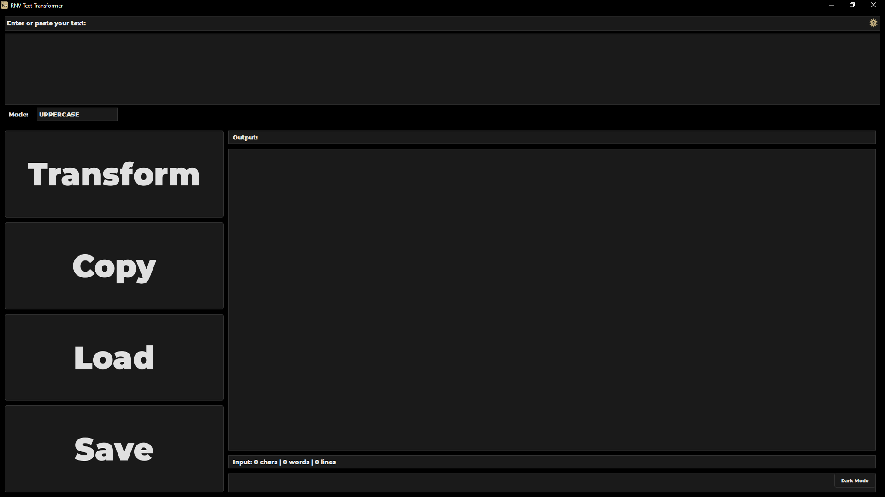
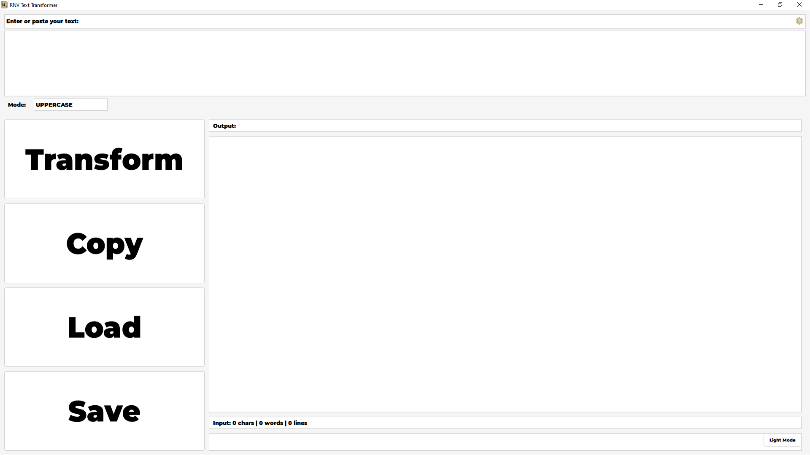
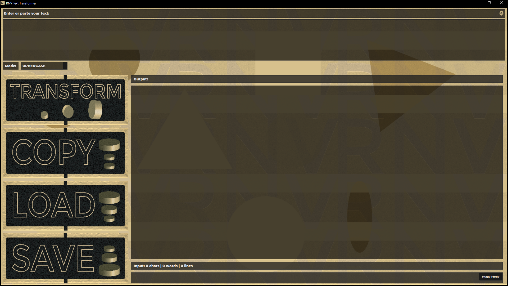
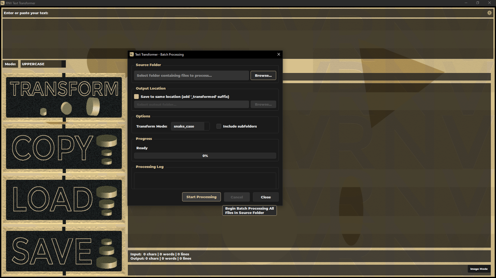
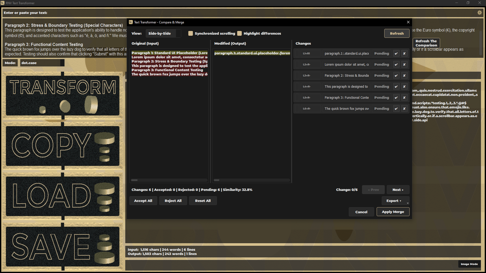
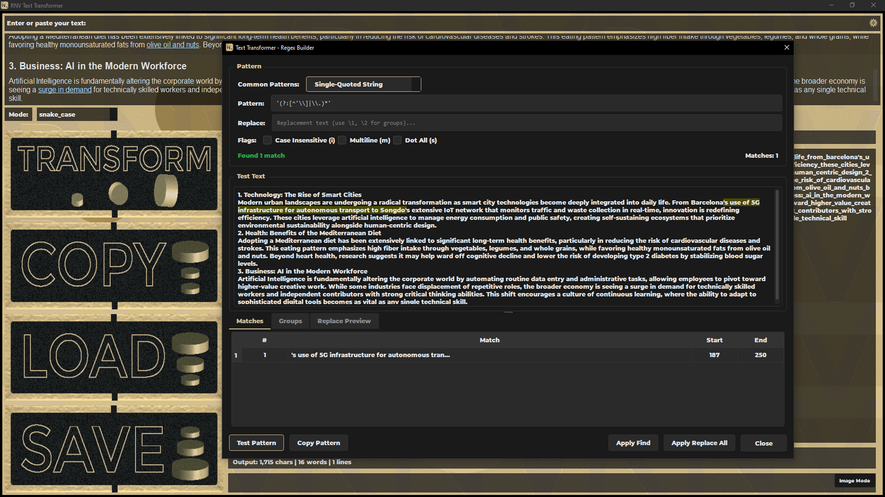

# RNV Text Transformer

[](https://github.com/RNVizion/rnv-text-transformer/actions/workflows/tests.yml)
[](https://github.com/RNVizion/rnv-text-transformer/actions/workflows/tests.yml)
[](https://codecov.io/gh/RNVizion/rnv-text-transformer)
[](https://www.python.org/downloads/)
[](LICENSE)

**A professional-grade desktop text transformation suite built with PyQt6.**

RNV Text Transformer is a Windows desktop application for transforming, cleaning, comparing, and batch-processing text across 10+ file formats. It combines a polished three-theme UI with a full-featured command-line interface and a background folder-watching engine, all backed by a modular, fully type-hinted Python 3.13 codebase.

---

## Table of Contents

- [Highlights](#highlights)
- [Screenshots](#screenshots)
- [Features](#features)
- [Installation](#installation)
- [Usage](#usage)
- [Building a Standalone Executable](#building-a-standalone-executable)
- [Architecture](#architecture)
- [Testing](#testing)
- [Engineering Notes](#engineering-notes)
- [Built With](#built-with)
- [License](#license)
- [Author](#author)

---

## Highlights

- **11 transformation modes** — from the basics (UPPERCASE, Title Case) to developer-focused conversions (camelCase, snake_case, CONSTANT_CASE, kebab-case, dot.case, iNVERTED)
- **9+ input formats, 6 export formats** — read `.txt`, `.md`, `.docx`, `.pdf`, `.rtf`, `.py`, `.js`, `.html`, `.log`; export to `.txt`, `.docx`, `.html`, `.pdf`, `.md`, `.rtf`
- **Three theme modes** — dark, light, and a fully custom image mode with gold-accented UI elements
- **Full CLI** — scriptable, pipe-friendly, with batch and preset support
- **Folder watching** — run transform rules automatically when files land in a directory
- **Compare view** — side-by-side or inline diff with synchronized scrolling
- **Regex builder** — live-preview regex patterns against sample text with capture-group highlighting
- **Preset system** — chain transforms, cleanups, and split/join operations into reusable workflows
- **Modular architecture** — clean separation of `core/`, `ui/`, `utils/`, and `cli/` packages with proper `__init__.py` boundaries
- **Comprehensive test suite** — 786 tests across `unittest`, `pytest`, `hypothesis`, and `syrupy`, with ~76% coverage running on Linux + Windows CI

---

## Screenshots

| Dark Mode | Light Mode |
|-----------|------------|
|  |  |

| Image Mode | Batch Processing |
|------------|------------------|
|  |  |

| Compare Dialog | Regex Builder |
|----------------|---------------|
|  |  |

---

## Features

### Text Transformation

Eleven transformation modes covering everyday text editing and code-style conversions:

| Category | Modes |
|----------|-------|
| Basic case | UPPERCASE, lowercase, Title Case, Sentence case |
| Developer | camelCase, PascalCase, snake_case, CONSTANT_CASE, kebab-case, dot.case, iNVERTED cASE |

### File I/O

Read from and write to a wide range of formats, with background threading for large files so the UI never freezes:

- **Text / code:** `.txt`, `.md`, `.py`, `.js`, `.html`, `.log`
- **Documents:** `.docx`, `.pdf`, `.rtf`
- **Export targets:** `.txt`, `.docx`, `.html`, `.pdf`, `.md`, `.rtf`

### Advanced Tools

- **Find & Replace** with full regex support and capture-group highlighting
- **Regex Builder** with live match preview and pattern library
- **Text cleanup** — normalize whitespace, line endings, Unicode, HTML stripping, and more
- **Split / Join** — convert between lines, tokens, paragraphs
- **Compare view** — side-by-side or inline diff with synchronized scrolling
- **Encoding converter** — detect and convert between text encodings
- **Undo/redo history** for transformed output
- **Recent files** with persistent history
- **Keyboard shortcuts** for every major action

### Automation

- **Batch processing** — apply a transform to entire folders with one click
- **Folder watching** — automatically process files as they are added to a watched folder, using rules you configure
- **Preset system** — chain multiple operations (cleanup → transform → split) into reusable named workflows

### Themes

- **Dark mode** with brand gold accent (`#d2bc93`)
- **Light mode** with darker gold accent (`#b19145`)
- **Image mode** with fully custom background imagery and transparent UI overlays

A custom themed-tooltip system bypasses native Qt tooltip rendering to deliver consistent cross-platform styling.

### CLI

The command-line interface offers everything the GUI does, designed for scripting and pipelines:

```bash
# Transform a file
rnv-transform input.txt --mode snake_case --output result.txt

# Batch-process a folder
rnv-transform ./docs/ --mode "Title Case" --output-dir ./converted/ --recursive

# Apply a preset
rnv-transform input.txt --preset "Code Variable Cleanup" --output clean.txt

# Pipe from stdin to stdout
cat input.txt | rnv-transform --mode lowercase > output.txt

# Discovery
rnv-transform --list-modes
rnv-transform --list-presets
rnv-transform --list-cleanup
```

---

## Installation

### Prerequisites

- Python 3.10 or later (3.13 recommended)
- Windows 10/11 (primary target; Linux works too — CI runs against both)

### Setup

```bash
# Clone the repository
git clone https://github.com/RNVizion/rnv-text-transformer.git
cd rnv-text-transformer

# (Recommended) create a virtual environment
python -m venv .venv
.venv\Scripts\activate       # Windows
# source .venv/bin/activate  # macOS / Linux

# Install dependencies — choose one:
pip install -r requirements.txt    # standard
# pip install -e .                 # editable install using pyproject.toml (recommended for dev)
```

---

## Usage

### Launch the GUI

```bash
python RNV_Text_Transformer.py
```

### Run the CLI

```bash
python -m cli.rnv_transform --help
```

### Clean build artifacts

```bat
clean_python_cache.bat      # Windows
./clean_python_cache.sh     # macOS / Linux
```

---

## Building a Standalone Executable

The project ships with [PyInstaller](https://pyinstaller.org/) build scripts for both platforms. Each script auto-activates `.venv` if present, verifies PyInstaller is installed, cleans previous build artifacts, runs the build against `RNV_Text_Transformer.spec`, and reports the output location.

```bash
# Windows
build_windows.bat

# Linux / macOS
chmod +x build_linux.sh    # first time only
./build_linux.sh
```

Output lands at `dist/RNV Text Transformer/`. The spec file bundles the full `resources/` folder, resolves lazy-imported dependencies (`docx`, `pypdf`, `reportlab`, `watchdog`), excludes unused heavy libraries, and suppresses the console window on Windows.

To produce a single-file distribution instead of a folder, see the commented alternative block at the bottom of `RNV_Text_Transformer.spec`.

If you'd rather invoke PyInstaller manually:

```bash
pip install pyinstaller
pyinstaller --noconfirm RNV_Text_Transformer.spec
```

---

## Architecture

The project follows a clear four-package layout that separates concerns:

```
rnv-text-transformer/
├── RNV_Text_Transformer.py       # GUI entry point
├── requirements.txt
├── pyproject.toml
├── LICENSE
├── README.md
├── ARCHITECTURE.md
│
├── build_windows.bat              # One-click build for Windows
├── build_linux.sh                 # One-click build for Linux/macOS
├── clean_python_cache.bat         # Cache cleanup for Windows
├── clean_python_cache.sh          # Cache cleanup for Linux/macOS
│
├── core/                          # Business logic (no UI dependencies)
│   ├── text_transformer.py        # 11 transformation modes
│   ├── text_cleaner.py            # Cleanup and split/join operations
│   ├── text_statistics.py         # Word/line/character analysis
│   ├── diff_engine.py             # Text comparison
│   ├── export_manager.py          # Multi-format export
│   ├── preset_manager.py          # Preset storage and execution
│   ├── regex_patterns.py          # Pattern library
│   ├── resource_loader.py         # Image and resource caching
│   ├── theme_manager.py           # Dark/Light/Image theme state
│   ├── batch_processor.py         # Folder batch processing
│   └── folder_watcher.py          # Background folder monitoring
│
├── ui/                            # PyQt6 widgets and dialogs
│   ├── main_window.py             # Primary application window
│   ├── base_dialog.py             # Common dialog base class
│   ├── image_button.py            # Image-mode-aware button
│   ├── drag_drop_text_edit.py     # Drop-target text widget
│   ├── line_number_text_edit.py   # Gutter-enabled text widget
│   └── *_dialog.py                # 10 specialized dialogs
│
├── utils/                         # Cross-cutting utilities
│   ├── config.py                  # Single source of truth for version, paths, constants
│   ├── dialog_styles.py           # Single source of truth for all colors and stylesheets
│   ├── file_handler.py            # Multi-format file I/O
│   ├── settings_manager.py        # QSettings-backed persistence
│   ├── clipboard_utils.py         # Clipboard operations
│   ├── async_workers.py           # Background QThread workers
│   ├── error_handler.py           # Centralized error routing
│   ├── dialog_helper.py           # Common dialog helpers
│   └── logger.py                  # Color-coded structured logging
│
├── cli/                           # Command-line interface
│   └── rnv_transform.py
│
├── tests/                         # Pytest suite
│   ├── conftest.py                # Shared fixtures
│   ├── test_main_window.py        # MainWindow construction + interactions
│   ├── test_*_dialog.py           # Per-dialog interaction tests
│   ├── test_logic_gap_fill.py     # Pure-logic coverage gap-fill
│   ├── test_workers.py            # QThread worker tests
│   ├── test_cli.py                # CLI command tests
│   ├── test_properties.py         # Hypothesis property tests
│   ├── test_snapshots.py          # Syrupy snapshot tests
│   ├── test_benchmarks.py         # Performance benchmarks
│   └── README.md                  # Test suite documentation
│
├── resources/                     # Static assets
│   ├── button_images/
│   ├── background_images/
│   ├── fonts/
│   ├── icons/
│   └── screenshots/               # README screenshots
│
├── .github/workflows/             # CI workflows
│   └── tests.yml                  # Linux + Windows test matrix
│
└── test_rnv_text_transformer.py   # Frozen unittest regression suite
```

### Design Principles

- **Single source of truth.** All colors live in `utils/dialog_styles.py` (`DARK` and `LIGHT` dicts). The version string lives only in `utils/config.py`. No duplication.
- **Centralized styling.** Every dialog inherits from `BaseDialog`, which delegates appearance to `DialogStyleManager` — a single stylesheet generator with LRU caching for performance.
- **Pre-warmed caches.** At startup, the app pre-warms the stylesheet cache and pre-loads button images so the first dialog opens instantly.
- **Threaded file I/O.** Large files load on `FileLoaderThread`; expensive transforms run on `TextTransformThread`. The UI never blocks.
- **Type hints everywhere.** All modules use modern Python 3.10+ type syntax (`str | None`, `list[str]`, `ClassVar`, `__slots__` for memory efficiency).
- **Lazy imports.** Heavy libraries (`docx`, `pypdf`, `striprtf`, `reportlab`) are imported only when needed, keeping cold-start fast.

For full architectural detail — dependency rules, startup sequence, threading model, signal flow, caching strategy, extension points, and known constraints — see [ARCHITECTURE.md](ARCHITECTURE.md).

---

## Testing

The project ships with **786 tests across two complementary suites**, achieving ~76% coverage on both Linux and Windows. CI runs the full suite on every push and pull request.

### Quick start

```bash
# Run everything (both suites + combined coverage report)
python run_tests.py

# Run only the pytest suite
python -m pytest tests/

# Run only the unittest suite
python -m unittest test_rnv_text_transformer
```

### Suite composition

| Suite | Tests | Purpose |
|-------|------:|---------|
| `test_rnv_text_transformer.py` (unittest) | 398 | Frozen regression suite — core logic, file I/O, transformations, exports, error handling. SHA-pinned and never edited after release. |
| `tests/` (pytest) | 388 | UI interactions, property-based tests (`hypothesis`), snapshot tests (`syrupy`), benchmarks, CLI tests, coverage gap-fill |

### Methodology

The test plan uses multiple complementary techniques:

- **`unittest`** for the frozen core regression suite
- **`pytest` + `pytest-qt`** for headless UI interaction tests (qtbot, signal verification, modal dialog mocking)
- **`hypothesis`** for property-based testing of idempotent transformations
- **`syrupy`** for snapshot testing of generated stylesheets and export output formats
- **`pytest-benchmark`** for performance regression tracking
- **`coverage.py`** with branch coverage enabled

The full suite is documented in [`tests/README.md`](tests/README.md), including conventions for fixtures, modal dialog mocking, and the QThread testing pattern that sidesteps `coverage.py`'s limitation on `QThread.run()` instrumentation.

---

## Engineering Notes

The test suite caught **four production bugs** during development, each with a dedicated regression-guard test:

| # | Bug | Found by | Severity |
|---|-----|----------|----------|
| 1 | `remove_duplicate_lines` was non-idempotent for non-LF separators | Hypothesis property test | Logic |
| 2 | Four sibling cleanup functions shared the same idempotency bug | Hypothesis property test | Logic |
| 3 | `preset_dialog._setup_ui` called a method name that didn't exist on `TextCleaner`, crashing the CLEANUP step UI | qtbot interaction test | Crash |
| 4 | `watch_folder_dialog._load_rule` silently overwrote `rule.file_patterns` to `["*.txt"]` on every dialog open, causing silent data loss of user-saved patterns | qtbot interaction test | **Data loss** |

Bug #4 is the most consequential — the dialog would quietly destroy multi-pattern rules (e.g. `["*.py", "*.md"]`) every time a user opened it and made any change. No crash, no error message, no warning. It went undetected through normal manual testing because the corruption was only visible by inspecting the saved settings file. The regression guard test now exercises the multi-pattern load path explicitly.

The methodology that found these bugs — property-based testing for pure logic, interaction testing with qtbot for UI flows — is documented further in `tests/README.md`.

---

## Built With

- **[Python 3.13](https://www.python.org/)** — language
- **[PyQt6](https://pypi.org/project/PyQt6/)** — GUI framework
- **[Pillow](https://pypi.org/project/Pillow/)** — image processing for theme backgrounds
- **[python-docx](https://pypi.org/project/python-docx/)** — Word document I/O
- **[pypdf](https://pypi.org/project/pypdf/)** — PDF reading
- **[reportlab](https://pypi.org/project/reportlab/)** — PDF export
- **[striprtf](https://pypi.org/project/striprtf/)** — RTF parsing
- **[chardet](https://pypi.org/project/chardet/)** — encoding detection
- **[watchdog](https://pypi.org/project/watchdog/)** — folder monitoring

### Test stack

- **[pytest](https://docs.pytest.org/)** + **[pytest-qt](https://pytest-qt.readthedocs.io/)** — UI test runner with Qt event-loop integration
- **[hypothesis](https://hypothesis.readthedocs.io/)** — property-based testing
- **[syrupy](https://github.com/syrupy-project/syrupy)** — snapshot testing
- **[pytest-benchmark](https://pytest-benchmark.readthedocs.io/)** — performance benchmarking
- **[coverage.py](https://coverage.readthedocs.io/)** — coverage tracking with branch coverage

---

## License

Released under the [MIT License](LICENSE). See the LICENSE file for the full text.

---

## Author

Built by [RNVizion](https://github.com/RNVizion).

If you find this project interesting or useful, feel free to reach out or open an issue.
